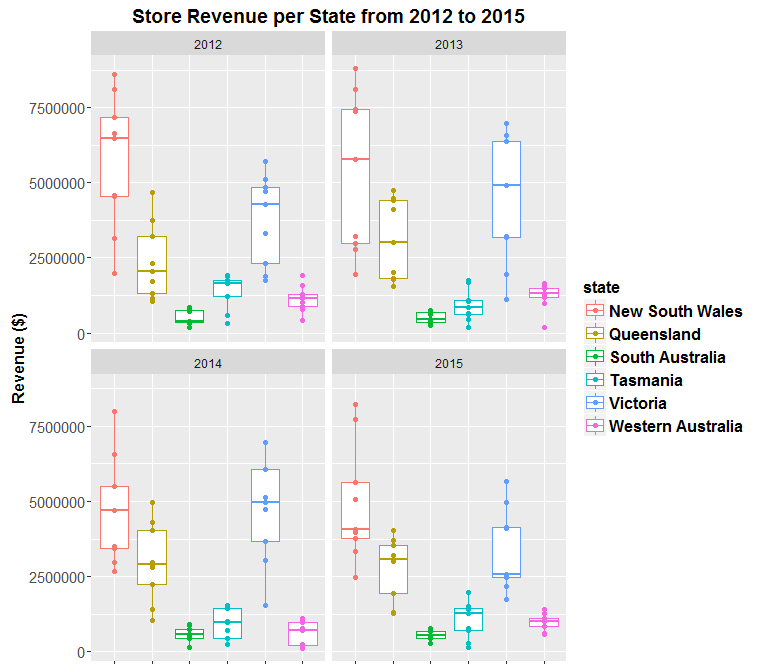

# Using the plotly package to give your ggplot2 plots simple reactivity to user input
Daniel P Newman  
30 September 2016  

##First make up some fake revenue data for a company with a number of shops operating in each State from 2012 to 2015:

```r
### Install/load required packages
#List of R packages required for this analysis:
required_packages <- c("ggplot2", "stringr", "plotly", "dplyr")
#Install required_packages:
new.packages <- required_packages[!(required_packages %in% installed.packages()[,"Package"])]
if(length(new.packages)) install.packages(new.packages)
#Load required_packages:
lapply(required_packages, require, character.only = TRUE)
```

```
## Loading required package: ggplot2
```

```
## Loading required package: stringr
```

```
## Loading required package: plotly
```

```
## 
## Attaching package: 'plotly'
```

```
## The following object is masked from 'package:ggplot2':
## 
##     last_plot
```

```
## The following object is masked from 'package:graphics':
## 
##     layout
```

```
## Loading required package: dplyr
```

```
## 
## Attaching package: 'dplyr'
```

```
## The following objects are masked from 'package:stats':
## 
##     filter, lag
```

```
## The following objects are masked from 'package:base':
## 
##     intersect, setdiff, setequal, union
```

```
## [[1]]
## [1] TRUE
## 
## [[2]]
## [1] TRUE
## 
## [[3]]
## [1] TRUE
## 
## [[4]]
## [1] TRUE
```

```r
#Set decimal points and disable scientific notation
options(digits=3, scipen=999) 

#Make up some fake data
df<-data_frame(state=rep(c("New South Wales", 
                 "Victoria", 
                 "Queensland",
                 "Western Australia",
                 "South Australia",
                 "Tasmania"), 36)) %>%
    group_by(state) %>%
    mutate(year=c(rep(2012, 9), rep(2013,9),rep(2014, 9),rep(2015, 9))) %>%
    group_by(state, year) %>%
    mutate(`store ID` = str_c("shop_#",as.character(seq_along(state)))) %>%
    group_by(state, year, `store ID`) %>%
    mutate(`Revenue ($)` =  ifelse(state=="New South Wales", sample(x=c(1000000:9000000), 1),
                            ifelse(state=="Victoria", sample(x=c(1000000:7000000), 1),
                            ifelse(state=="Queensland", sample(x=c(1000000:5000000), 1),
                            ifelse(state=="Western Australia",sample(x=c(100000:2000000), 1),
                            ifelse(state=="South Australia",sample(x=c(100000:900000), 1),       
                            ifelse(state=="Tasmania", sample(x=c(100000:2000000), 1), NA)))))))
```

##Now visualise this data using ggplot: 

```r
ggplot(df, aes(state, `Revenue ($)`, colour=state, label = `store ID`)) +
    geom_boxplot() + 
    geom_point() +
    theme(axis.title.x =  element_blank(),
          axis.text.x  =  element_blank(), 
          axis.title.y = element_text(face="bold", size=12),
          axis.text.y  = element_text(angle=0, vjust=0.5, size=11),
          legend.title = element_text(size=12, face="bold"),
          legend.text = element_text(size = 12, face = "bold"),
          plot.title = element_text(face="bold", size=14)) + 
    ggtitle("Store Revenue per State from 2012 to 2015") +
    facet_wrap(~year)
```

<!-- -->

##Now make the plot reactive to the user's mouse by wrapping plotly's ggplotly() function around it:

```r
ggplotly(ggplot(df, aes(state, `Revenue ($)`, colour=state, label = `store ID`)) +
    geom_boxplot() + 
    geom_point() +
    theme(plot.margin=unit(c(2,2,2,2),"cm")) + #top,right,bottom,left 
    theme(axis.title.x =  element_blank(),
          axis.text.x  =  element_blank(), 
          axis.title.y = element_text(face="bold", size=12),
          axis.text.y  = element_text(angle=0, vjust=0.5, size=11),
          legend.title = element_text(size=12, face="bold"),
          legend.text = element_text(size = 12, face = "bold"),
          plot.title = element_text(face="bold", size=14)) +
    ggtitle("Store Revenue per State from 2012 to 2015") +
    facet_wrap(~year),
    height=900, width=900)
```

<div id="htmlwidget-3e02d2d2ef158336a219" style="width:900px;height:900px;" class="plotly html-widget"></div>
<script type="application/json" data-for="htmlwidget-3e02d2d2ef158336a219">{"x":{"data":[{"x":[1,1,1,1,1,1,1,1,1],"y":[7313343,1731449,8847005,5464241,3763223,7998764,2904799,6166145,4188997],"type":"box","hoverinfo":"y","fillcolor":"rgba(255,255,255,1)","marker":{"opacity":null,"outliercolor":"rgba(0,0,0,1)","line":{"width":1.88976377952756,"color":"rgba(0,0,0,1)"},"size":5.66929133858268},"line":{"color":"rgba(248,118,109,1)","width":1.88976377952756},"name":"New South Wales","legendgroup":"New South Wales","showlegend":true,"xaxis":"x","yaxis":"y"},{"x":[2,2,2,2,2,2,2,2,2],"y":[4989367,4424506,3407838,2908308,3623959,4662990,4275205,3081510,1177359],"type":"box","hoverinfo":"y","fillcolor":"rgba(255,255,255,1)","marker":{"opacity":null,"outliercolor":"rgba(0,0,0,1)","line":{"width":1.88976377952756,"color":"rgba(0,0,0,1)"},"size":5.66929133858268},"line":{"color":"rgba(183,159,0,1)","width":1.88976377952756},"name":"Queensland","legendgroup":"Queensland","showlegend":true,"xaxis":"x","yaxis":"y"},{"x":[3,3,3,3,3,3,3,3,3],"y":[757824,458020,678567,849937,568805,341665,441086,461988,761228],"type":"box","hoverinfo":"y","fillcolor":"rgba(255,255,255,1)","marker":{"opacity":null,"outliercolor":"rgba(0,0,0,1)","line":{"width":1.88976377952756,"color":"rgba(0,0,0,1)"},"size":5.66929133858268},"line":{"color":"rgba(0,186,56,1)","width":1.88976377952756},"name":"South Australia","legendgroup":"South Australia","showlegend":true,"xaxis":"x","yaxis":"y"},{"x":[4,4,4,4,4,4,4,4,4],"y":[146868,1374366,532720,814384,1650289,326607,913982,1848397,102296],"type":"box","hoverinfo":"y","fillcolor":"rgba(255,255,255,1)","marker":{"opacity":null,"outliercolor":"rgba(0,0,0,1)","line":{"width":1.88976377952756,"color":"rgba(0,0,0,1)"},"size":5.66929133858268},"line":{"color":"rgba(0,191,196,1)","width":1.88976377952756},"name":"Tasmania","legendgroup":"Tasmania","showlegend":true,"xaxis":"x","yaxis":"y"},{"x":[5,5,5,5,5,5,5,5,5],"y":[6816973,2981734,6152591,4671577,6601864,4678485,2643062,2729420,5526149],"type":"box","hoverinfo":"y","fillcolor":"rgba(255,255,255,1)","marker":{"opacity":null,"outliercolor":"rgba(0,0,0,1)","line":{"width":1.88976377952756,"color":"rgba(0,0,0,1)"},"size":5.66929133858268},"line":{"color":"rgba(97,156,255,1)","width":1.88976377952756},"name":"Victoria","legendgroup":"Victoria","showlegend":true,"xaxis":"x","yaxis":"y"},{"x":[6,6,6,6,6,6,6,6,6],"y":[1355139,1401606,570122,336740,1411083,1242263,1304108,465611,122699],"type":"box","hoverinfo":"y","fillcolor":"rgba(255,255,255,1)","marker":{"opacity":null,"outliercolor":"rgba(0,0,0,1)","line":{"width":1.88976377952756,"color":"rgba(0,0,0,1)"},"size":5.66929133858268},"line":{"color":"rgba(245,100,227,1)","width":1.88976377952756},"name":"Western Australia","legendgroup":"Western Australia","showlegend":true,"xaxis":"x","yaxis":"y"},{"x":[1,1,1,1,1,1,1,1,1],"y":[8582332,6660871,7462682,4610457,6378403,2636891,7996154,2279011,8643157],"type":"box","hoverinfo":"y","fillcolor":"rgba(255,255,255,1)","marker":{"opacity":null,"outliercolor":"rgba(0,0,0,1)","line":{"width":1.88976377952756,"color":"rgba(0,0,0,1)"},"size":5.66929133858268},"line":{"color":"rgba(248,118,109,1)","width":1.88976377952756},"name":"New South Wales","legendgroup":"New South Wales","showlegend":false,"xaxis":"x2","yaxis":"y"},{"x":[2,2,2,2,2,2,2,2,2],"y":[4475425,1758248,2793813,1274602,4739395,4387394,1783278,3599623,1638226],"type":"box","hoverinfo":"y","fillcolor":"rgba(255,255,255,1)","marker":{"opacity":null,"outliercolor":"rgba(0,0,0,1)","line":{"width":1.88976377952756,"color":"rgba(0,0,0,1)"},"size":5.66929133858268},"line":{"color":"rgba(183,159,0,1)","width":1.88976377952756},"name":"Queensland","legendgroup":"Queensland","showlegend":false,"xaxis":"x2","yaxis":"y"},{"x":[3,3,3,3,3,3,3,3,3],"y":[828476,468467,455436,238737,583943,657346,136881,475137,823784],"type":"box","hoverinfo":"y","fillcolor":"rgba(255,255,255,1)","marker":{"opacity":null,"outliercolor":"rgba(0,0,0,1)","line":{"width":1.88976377952756,"color":"rgba(0,0,0,1)"},"size":5.66929133858268},"line":{"color":"rgba(0,186,56,1)","width":1.88976377952756},"name":"South Australia","legendgroup":"South Australia","showlegend":false,"xaxis":"x2","yaxis":"y"},{"x":[4,4,4,4,4,4,4,4,4],"y":[658621,332227,603198,753438,877942,755878,215063,624096,1795217],"type":"box","hoverinfo":"y","fillcolor":"rgba(255,255,255,1)","marker":{"opacity":null,"outliercolor":"rgba(0,0,0,1)","line":{"width":1.88976377952756,"color":"rgba(0,0,0,1)"},"size":5.66929133858268},"line":{"color":"rgba(0,191,196,1)","width":1.88976377952756},"name":"Tasmania","legendgroup":"Tasmania","showlegend":false,"xaxis":"x2","yaxis":"y"},{"x":[5,5,5,5,5,5,5,5,5],"y":[2724007,4378011,3241166,6498382,4106210,1022292,4490969,2337199,3880887],"type":"box","hoverinfo":"y","fillcolor":"rgba(255,255,255,1)","marker":{"opacity":null,"outliercolor":"rgba(0,0,0,1)","line":{"width":1.88976377952756,"color":"rgba(0,0,0,1)"},"size":5.66929133858268},"line":{"color":"rgba(97,156,255,1)","width":1.88976377952756},"name":"Victoria","legendgroup":"Victoria","showlegend":false,"xaxis":"x2","yaxis":"y"},{"x":[6,6,6,6,6,6,6,6,6],"y":[111648,1820356,1479090,803280,591279,175053,1897822,181642,1110222],"type":"box","hoverinfo":"y","fillcolor":"rgba(255,255,255,1)","marker":{"opacity":null,"outliercolor":"rgba(0,0,0,1)","line":{"width":1.88976377952756,"color":"rgba(0,0,0,1)"},"size":5.66929133858268},"line":{"color":"rgba(245,100,227,1)","width":1.88976377952756},"name":"Western Australia","legendgroup":"Western Australia","showlegend":false,"xaxis":"x2","yaxis":"y"},{"x":[1,1,1,1,1,1,1,1,1],"y":[6021338,1655223,5439082,7385881,4804136,4933584,8705168,7105247,4753527],"type":"box","hoverinfo":"y","fillcolor":"rgba(255,255,255,1)","marker":{"opacity":null,"outliercolor":"rgba(0,0,0,1)","line":{"width":1.88976377952756,"color":"rgba(0,0,0,1)"},"size":5.66929133858268},"line":{"color":"rgba(248,118,109,1)","width":1.88976377952756},"name":"New South Wales","legendgroup":"New South Wales","showlegend":false,"xaxis":"x","yaxis":"y2"},{"x":[2,2,2,2,2,2,2,2,2],"y":[3559351,1207971,4809086,4613683,1003759,4324514,3157916,2866660,3103552],"type":"box","hoverinfo":"y","fillcolor":"rgba(255,255,255,1)","marker":{"opacity":null,"outliercolor":"rgba(0,0,0,1)","line":{"width":1.88976377952756,"color":"rgba(0,0,0,1)"},"size":5.66929133858268},"line":{"color":"rgba(183,159,0,1)","width":1.88976377952756},"name":"Queensland","legendgroup":"Queensland","showlegend":false,"xaxis":"x","yaxis":"y2"},{"x":[3,3,3,3,3,3,3,3,3],"y":[237285,799983,841242,276907,490220,171013,710194,141357,747833],"type":"box","hoverinfo":"y","fillcolor":"rgba(255,255,255,1)","marker":{"opacity":null,"outliercolor":"rgba(0,0,0,1)","line":{"width":1.88976377952756,"color":"rgba(0,0,0,1)"},"size":5.66929133858268},"line":{"color":"rgba(0,186,56,1)","width":1.88976377952756},"name":"South Australia","legendgroup":"South Australia","showlegend":false,"xaxis":"x","yaxis":"y2"},{"x":[4,4,4,4,4,4,4,4,4],"y":[179745,987276,1944491,519176,242665,381267,1418597,1705626,354819],"type":"box","hoverinfo":"y","fillcolor":"rgba(255,255,255,1)","marker":{"opacity":null,"outliercolor":"rgba(0,0,0,1)","line":{"width":1.88976377952756,"color":"rgba(0,0,0,1)"},"size":5.66929133858268},"line":{"color":"rgba(0,191,196,1)","width":1.88976377952756},"name":"Tasmania","legendgroup":"Tasmania","showlegend":false,"xaxis":"x","yaxis":"y2"},{"x":[5,5,5,5,5,5,5,5,5],"y":[3869576,4823623,6455313,1133583,2841300,6816103,5318405,4931984,5160908],"type":"box","hoverinfo":"y","fillcolor":"rgba(255,255,255,1)","marker":{"opacity":null,"outliercolor":"rgba(0,0,0,1)","line":{"width":1.88976377952756,"color":"rgba(0,0,0,1)"},"size":5.66929133858268},"line":{"color":"rgba(97,156,255,1)","width":1.88976377952756},"name":"Victoria","legendgroup":"Victoria","showlegend":false,"xaxis":"x","yaxis":"y2"},{"x":[6,6,6,6,6,6,6,6,6],"y":[1485637,210974,1059854,1558759,1737786,1539514,1679145,410373,325452],"type":"box","hoverinfo":"y","fillcolor":"rgba(255,255,255,1)","marker":{"opacity":null,"outliercolor":"rgba(0,0,0,1)","line":{"width":1.88976377952756,"color":"rgba(0,0,0,1)"},"size":5.66929133858268},"line":{"color":"rgba(245,100,227,1)","width":1.88976377952756},"name":"Western Australia","legendgroup":"Western Australia","showlegend":false,"xaxis":"x","yaxis":"y2"},{"x":[1,1,1,1,1,1,1,1,1],"y":[1089228,6498911,8100485,4057074,7384208,4721676,8752538,3113789,3558434],"type":"box","hoverinfo":"y","fillcolor":"rgba(255,255,255,1)","marker":{"opacity":null,"outliercolor":"rgba(0,0,0,1)","line":{"width":1.88976377952756,"color":"rgba(0,0,0,1)"},"size":5.66929133858268},"line":{"color":"rgba(248,118,109,1)","width":1.88976377952756},"name":"New South Wales","legendgroup":"New South Wales","showlegend":false,"xaxis":"x2","yaxis":"y2"},{"x":[2,2,2,2,2,2,2,2,2],"y":[4239735,4540136,4517924,1923726,1319052,1304241,3313755,1656062,3714695],"type":"box","hoverinfo":"y","fillcolor":"rgba(255,255,255,1)","marker":{"opacity":null,"outliercolor":"rgba(0,0,0,1)","line":{"width":1.88976377952756,"color":"rgba(0,0,0,1)"},"size":5.66929133858268},"line":{"color":"rgba(183,159,0,1)","width":1.88976377952756},"name":"Queensland","legendgroup":"Queensland","showlegend":false,"xaxis":"x2","yaxis":"y2"},{"x":[3,3,3,3,3,3,3,3,3],"y":[231544,145334,860561,670250,442624,208712,744420,827653,438917],"type":"box","hoverinfo":"y","fillcolor":"rgba(255,255,255,1)","marker":{"opacity":null,"outliercolor":"rgba(0,0,0,1)","line":{"width":1.88976377952756,"color":"rgba(0,0,0,1)"},"size":5.66929133858268},"line":{"color":"rgba(0,186,56,1)","width":1.88976377952756},"name":"South Australia","legendgroup":"South Australia","showlegend":false,"xaxis":"x2","yaxis":"y2"},{"x":[4,4,4,4,4,4,4,4,4],"y":[1591416,1893466,330925,1718566,1186320,314319,540861,1579510,1993179],"type":"box","hoverinfo":"y","fillcolor":"rgba(255,255,255,1)","marker":{"opacity":null,"outliercolor":"rgba(0,0,0,1)","line":{"width":1.88976377952756,"color":"rgba(0,0,0,1)"},"size":5.66929133858268},"line":{"color":"rgba(0,191,196,1)","width":1.88976377952756},"name":"Tasmania","legendgroup":"Tasmania","showlegend":false,"xaxis":"x2","yaxis":"y2"},{"x":[5,5,5,5,5,5,5,5,5],"y":[5357163,3776306,2118319,5903113,4556181,5097978,5338314,6021176,5082435],"type":"box","hoverinfo":"y","fillcolor":"rgba(255,255,255,1)","marker":{"opacity":null,"outliercolor":"rgba(0,0,0,1)","line":{"width":1.88976377952756,"color":"rgba(0,0,0,1)"},"size":5.66929133858268},"line":{"color":"rgba(97,156,255,1)","width":1.88976377952756},"name":"Victoria","legendgroup":"Victoria","showlegend":false,"xaxis":"x2","yaxis":"y2"},{"x":[6,6,6,6,6,6,6,6,6],"y":[1847364,1945235,101991,241995,458773,1219145,766228,1706321,711479],"type":"box","hoverinfo":"y","fillcolor":"rgba(255,255,255,1)","marker":{"opacity":null,"outliercolor":"rgba(0,0,0,1)","line":{"width":1.88976377952756,"color":"rgba(0,0,0,1)"},"size":5.66929133858268},"line":{"color":"rgba(245,100,227,1)","width":1.88976377952756},"name":"Western Australia","legendgroup":"Western Australia","showlegend":false,"xaxis":"x2","yaxis":"y2"},{"x":[1,1,1,1,1,1,1,1,1],"y":[7313343,7998764,4188997,1731449,5464241,3763223,6166145,8847005,2904799],"text":["state: New South Wales<br>`Revenue ($)`: 7313343<br>state: New South Wales<br>`store ID`: shop_#1","state: New South Wales<br>`Revenue ($)`: 7998764<br>state: New South Wales<br>`store ID`: shop_#2","state: New South Wales<br>`Revenue ($)`: 4188997<br>state: New South Wales<br>`store ID`: shop_#3","state: New South Wales<br>`Revenue ($)`: 1731449<br>state: New South Wales<br>`store ID`: shop_#4","state: New South Wales<br>`Revenue ($)`: 5464241<br>state: New South Wales<br>`store ID`: shop_#5","state: New South Wales<br>`Revenue ($)`: 3763223<br>state: New South Wales<br>`store ID`: shop_#6","state: New South Wales<br>`Revenue ($)`: 6166145<br>state: New South Wales<br>`store ID`: shop_#7","state: New South Wales<br>`Revenue ($)`: 8847005<br>state: New South Wales<br>`store ID`: shop_#8","state: New South Wales<br>`Revenue ($)`: 2904799<br>state: New South Wales<br>`store ID`: shop_#9"],"key":null,"type":"scatter","mode":"markers","marker":{"autocolorscale":false,"color":"rgba(248,118,109,1)","opacity":1,"size":5.66929133858268,"symbol":"circle","line":{"width":1.88976377952756,"color":"rgba(248,118,109,1)"}},"name":"New South Wales","legendgroup":"New South Wales","showlegend":false,"xaxis":"x","yaxis":"y","hoverinfo":"text"},{"x":[2,2,2,2,2,2,2,2,2],"y":[3407838,3623959,4989367,4662990,4275205,3081510,1177359,2908308,4424506],"text":["state: Queensland<br>`Revenue ($)`: 3407838<br>state: Queensland<br>`store ID`: shop_#1","state: Queensland<br>`Revenue ($)`: 3623959<br>state: Queensland<br>`store ID`: shop_#2","state: Queensland<br>`Revenue ($)`: 4989367<br>state: Queensland<br>`store ID`: shop_#3","state: Queensland<br>`Revenue ($)`: 4662990<br>state: Queensland<br>`store ID`: shop_#4","state: Queensland<br>`Revenue ($)`: 4275205<br>state: Queensland<br>`store ID`: shop_#5","state: Queensland<br>`Revenue ($)`: 3081510<br>state: Queensland<br>`store ID`: shop_#6","state: Queensland<br>`Revenue ($)`: 1177359<br>state: Queensland<br>`store ID`: shop_#7","state: Queensland<br>`Revenue ($)`: 2908308<br>state: Queensland<br>`store ID`: shop_#8","state: Queensland<br>`Revenue ($)`: 4424506<br>state: Queensland<br>`store ID`: shop_#9"],"key":null,"type":"scatter","mode":"markers","marker":{"autocolorscale":false,"color":"rgba(183,159,0,1)","opacity":1,"size":5.66929133858268,"symbol":"circle","line":{"width":1.88976377952756,"color":"rgba(183,159,0,1)"}},"name":"Queensland","legendgroup":"Queensland","showlegend":false,"xaxis":"x","yaxis":"y","hoverinfo":"text"},{"x":[3,3,3,3,3,3,3,3,3],"y":[441086,461988,458020,849937,757824,678567,568805,341665,761228],"text":["state: South Australia<br>`Revenue ($)`: 441086<br>state: South Australia<br>`store ID`: shop_#1","state: South Australia<br>`Revenue ($)`: 461988<br>state: South Australia<br>`store ID`: shop_#2","state: South Australia<br>`Revenue ($)`: 458020<br>state: South Australia<br>`store ID`: shop_#3","state: South Australia<br>`Revenue ($)`: 849937<br>state: South Australia<br>`store ID`: shop_#4","state: South Australia<br>`Revenue ($)`: 757824<br>state: South Australia<br>`store ID`: shop_#5","state: South Australia<br>`Revenue ($)`: 678567<br>state: South Australia<br>`store ID`: shop_#6","state: South Australia<br>`Revenue ($)`: 568805<br>state: South Australia<br>`store ID`: shop_#7","state: South Australia<br>`Revenue ($)`: 341665<br>state: South Australia<br>`store ID`: shop_#8","state: South Australia<br>`Revenue ($)`: 761228<br>state: South Australia<br>`store ID`: shop_#9"],"key":null,"type":"scatter","mode":"markers","marker":{"autocolorscale":false,"color":"rgba(0,186,56,1)","opacity":1,"size":5.66929133858268,"symbol":"circle","line":{"width":1.88976377952756,"color":"rgba(0,186,56,1)"}},"name":"South Australia","legendgroup":"South Australia","showlegend":false,"xaxis":"x","yaxis":"y","hoverinfo":"text"},{"x":[4,4,4,4,4,4,4,4,4],"y":[532720,913982,1374366,1650289,326607,1848397,146868,814384,102296],"text":["state: Tasmania<br>`Revenue ($)`: 532720<br>state: Tasmania<br>`store ID`: shop_#1","state: Tasmania<br>`Revenue ($)`: 913982<br>state: Tasmania<br>`store ID`: shop_#2","state: Tasmania<br>`Revenue ($)`: 1374366<br>state: Tasmania<br>`store ID`: shop_#3","state: Tasmania<br>`Revenue ($)`: 1650289<br>state: Tasmania<br>`store ID`: shop_#4","state: Tasmania<br>`Revenue ($)`: 326607<br>state: Tasmania<br>`store ID`: shop_#5","state: Tasmania<br>`Revenue ($)`: 1848397<br>state: Tasmania<br>`store ID`: shop_#6","state: Tasmania<br>`Revenue ($)`: 146868<br>state: Tasmania<br>`store ID`: shop_#7","state: Tasmania<br>`Revenue ($)`: 814384<br>state: Tasmania<br>`store ID`: shop_#8","state: Tasmania<br>`Revenue ($)`: 102296<br>state: Tasmania<br>`store ID`: shop_#9"],"key":null,"type":"scatter","mode":"markers","marker":{"autocolorscale":false,"color":"rgba(0,191,196,1)","opacity":1,"size":5.66929133858268,"symbol":"circle","line":{"width":1.88976377952756,"color":"rgba(0,191,196,1)"}},"name":"Tasmania","legendgroup":"Tasmania","showlegend":false,"xaxis":"x","yaxis":"y","hoverinfo":"text"},{"x":[5,5,5,5,5,5,5,5,5],"y":[6816973,4671577,6601864,2643062,5526149,4678485,2729420,2981734,6152591],"text":["state: Victoria<br>`Revenue ($)`: 6816973<br>state: Victoria<br>`store ID`: shop_#1","state: Victoria<br>`Revenue ($)`: 4671577<br>state: Victoria<br>`store ID`: shop_#2","state: Victoria<br>`Revenue ($)`: 6601864<br>state: Victoria<br>`store ID`: shop_#3","state: Victoria<br>`Revenue ($)`: 2643062<br>state: Victoria<br>`store ID`: shop_#4","state: Victoria<br>`Revenue ($)`: 5526149<br>state: Victoria<br>`store ID`: shop_#5","state: Victoria<br>`Revenue ($)`: 4678485<br>state: Victoria<br>`store ID`: shop_#6","state: Victoria<br>`Revenue ($)`: 2729420<br>state: Victoria<br>`store ID`: shop_#7","state: Victoria<br>`Revenue ($)`: 2981734<br>state: Victoria<br>`store ID`: shop_#8","state: Victoria<br>`Revenue ($)`: 6152591<br>state: Victoria<br>`store ID`: shop_#9"],"key":null,"type":"scatter","mode":"markers","marker":{"autocolorscale":false,"color":"rgba(97,156,255,1)","opacity":1,"size":5.66929133858268,"symbol":"circle","line":{"width":1.88976377952756,"color":"rgba(97,156,255,1)"}},"name":"Victoria","legendgroup":"Victoria","showlegend":false,"xaxis":"x","yaxis":"y","hoverinfo":"text"},{"x":[6,6,6,6,6,6,6,6,6],"y":[465611,1242263,1355139,1401606,570122,336740,122699,1411083,1304108],"text":["state: Western Australia<br>`Revenue ($)`: 465611<br>state: Western Australia<br>`store ID`: shop_#1","state: Western Australia<br>`Revenue ($)`: 1242263<br>state: Western Australia<br>`store ID`: shop_#2","state: Western Australia<br>`Revenue ($)`: 1355139<br>state: Western Australia<br>`store ID`: shop_#3","state: Western Australia<br>`Revenue ($)`: 1401606<br>state: Western Australia<br>`store ID`: shop_#4","state: Western Australia<br>`Revenue ($)`: 570122<br>state: Western Australia<br>`store ID`: shop_#5","state: Western Australia<br>`Revenue ($)`: 336740<br>state: Western Australia<br>`store ID`: shop_#6","state: Western Australia<br>`Revenue ($)`: 122699<br>state: Western Australia<br>`store ID`: shop_#7","state: Western Australia<br>`Revenue ($)`: 1411083<br>state: Western Australia<br>`store ID`: shop_#8","state: Western Australia<br>`Revenue ($)`: 1304108<br>state: Western Australia<br>`store ID`: shop_#9"],"key":null,"type":"scatter","mode":"markers","marker":{"autocolorscale":false,"color":"rgba(245,100,227,1)","opacity":1,"size":5.66929133858268,"symbol":"circle","line":{"width":1.88976377952756,"color":"rgba(245,100,227,1)"}},"name":"Western Australia","legendgroup":"Western Australia","showlegend":false,"xaxis":"x","yaxis":"y","hoverinfo":"text"},{"x":[1,1,1,1,1,1,1,1,1],"y":[8582332,2636891,8643157,6660871,4610457,6378403,2279011,7462682,7996154],"text":["state: New South Wales<br>`Revenue ($)`: 8582332<br>state: New South Wales<br>`store ID`: shop_#1","state: New South Wales<br>`Revenue ($)`: 2636891<br>state: New South Wales<br>`store ID`: shop_#2","state: New South Wales<br>`Revenue ($)`: 8643157<br>state: New South Wales<br>`store ID`: shop_#3","state: New South Wales<br>`Revenue ($)`: 6660871<br>state: New South Wales<br>`store ID`: shop_#4","state: New South Wales<br>`Revenue ($)`: 4610457<br>state: New South Wales<br>`store ID`: shop_#5","state: New South Wales<br>`Revenue ($)`: 6378403<br>state: New South Wales<br>`store ID`: shop_#6","state: New South Wales<br>`Revenue ($)`: 2279011<br>state: New South Wales<br>`store ID`: shop_#7","state: New South Wales<br>`Revenue ($)`: 7462682<br>state: New South Wales<br>`store ID`: shop_#8","state: New South Wales<br>`Revenue ($)`: 7996154<br>state: New South Wales<br>`store ID`: shop_#9"],"key":null,"type":"scatter","mode":"markers","marker":{"autocolorscale":false,"color":"rgba(248,118,109,1)","opacity":1,"size":5.66929133858268,"symbol":"circle","line":{"width":1.88976377952756,"color":"rgba(248,118,109,1)"}},"name":"New South Wales","legendgroup":"New South Wales","showlegend":false,"xaxis":"x2","yaxis":"y","hoverinfo":"text"},{"x":[2,2,2,2,2,2,2,2,2],"y":[2793813,4739395,4475425,4387394,1783278,3599623,1638226,1274602,1758248],"text":["state: Queensland<br>`Revenue ($)`: 2793813<br>state: Queensland<br>`store ID`: shop_#1","state: Queensland<br>`Revenue ($)`: 4739395<br>state: Queensland<br>`store ID`: shop_#2","state: Queensland<br>`Revenue ($)`: 4475425<br>state: Queensland<br>`store ID`: shop_#3","state: Queensland<br>`Revenue ($)`: 4387394<br>state: Queensland<br>`store ID`: shop_#4","state: Queensland<br>`Revenue ($)`: 1783278<br>state: Queensland<br>`store ID`: shop_#5","state: Queensland<br>`Revenue ($)`: 3599623<br>state: Queensland<br>`store ID`: shop_#6","state: Queensland<br>`Revenue ($)`: 1638226<br>state: Queensland<br>`store ID`: shop_#7","state: Queensland<br>`Revenue ($)`: 1274602<br>state: Queensland<br>`store ID`: shop_#8","state: Queensland<br>`Revenue ($)`: 1758248<br>state: Queensland<br>`store ID`: shop_#9"],"key":null,"type":"scatter","mode":"markers","marker":{"autocolorscale":false,"color":"rgba(183,159,0,1)","opacity":1,"size":5.66929133858268,"symbol":"circle","line":{"width":1.88976377952756,"color":"rgba(183,159,0,1)"}},"name":"Queensland","legendgroup":"Queensland","showlegend":false,"xaxis":"x2","yaxis":"y","hoverinfo":"text"},{"x":[3,3,3,3,3,3,3,3,3],"y":[136881,475137,468467,238737,828476,455436,583943,657346,823784],"text":["state: South Australia<br>`Revenue ($)`: 136881<br>state: South Australia<br>`store ID`: shop_#1","state: South Australia<br>`Revenue ($)`: 475137<br>state: South Australia<br>`store ID`: shop_#2","state: South Australia<br>`Revenue ($)`: 468467<br>state: South Australia<br>`store ID`: shop_#3","state: South Australia<br>`Revenue ($)`: 238737<br>state: South Australia<br>`store ID`: shop_#4","state: South Australia<br>`Revenue ($)`: 828476<br>state: South Australia<br>`store ID`: shop_#5","state: South Australia<br>`Revenue ($)`: 455436<br>state: South Australia<br>`store ID`: shop_#6","state: South Australia<br>`Revenue ($)`: 583943<br>state: South Australia<br>`store ID`: shop_#7","state: South Australia<br>`Revenue ($)`: 657346<br>state: South Australia<br>`store ID`: shop_#8","state: South Australia<br>`Revenue ($)`: 823784<br>state: South Australia<br>`store ID`: shop_#9"],"key":null,"type":"scatter","mode":"markers","marker":{"autocolorscale":false,"color":"rgba(0,186,56,1)","opacity":1,"size":5.66929133858268,"symbol":"circle","line":{"width":1.88976377952756,"color":"rgba(0,186,56,1)"}},"name":"South Australia","legendgroup":"South Australia","showlegend":false,"xaxis":"x2","yaxis":"y","hoverinfo":"text"},{"x":[4,4,4,4,4,4,4,4,4],"y":[603198,215063,332227,877942,755878,624096,658621,753438,1795217],"text":["state: Tasmania<br>`Revenue ($)`: 603198<br>state: Tasmania<br>`store ID`: shop_#1","state: Tasmania<br>`Revenue ($)`: 215063<br>state: Tasmania<br>`store ID`: shop_#2","state: Tasmania<br>`Revenue ($)`: 332227<br>state: Tasmania<br>`store ID`: shop_#3","state: Tasmania<br>`Revenue ($)`: 877942<br>state: Tasmania<br>`store ID`: shop_#4","state: Tasmania<br>`Revenue ($)`: 755878<br>state: Tasmania<br>`store ID`: shop_#5","state: Tasmania<br>`Revenue ($)`: 624096<br>state: Tasmania<br>`store ID`: shop_#6","state: Tasmania<br>`Revenue ($)`: 658621<br>state: Tasmania<br>`store ID`: shop_#7","state: Tasmania<br>`Revenue ($)`: 753438<br>state: Tasmania<br>`store ID`: shop_#8","state: Tasmania<br>`Revenue ($)`: 1795217<br>state: Tasmania<br>`store ID`: shop_#9"],"key":null,"type":"scatter","mode":"markers","marker":{"autocolorscale":false,"color":"rgba(0,191,196,1)","opacity":1,"size":5.66929133858268,"symbol":"circle","line":{"width":1.88976377952756,"color":"rgba(0,191,196,1)"}},"name":"Tasmania","legendgroup":"Tasmania","showlegend":false,"xaxis":"x2","yaxis":"y","hoverinfo":"text"},{"x":[5,5,5,5,5,5,5,5,5],"y":[2724007,6498382,4106210,4490969,3880887,1022292,2337199,4378011,3241166],"text":["state: Victoria<br>`Revenue ($)`: 2724007<br>state: Victoria<br>`store ID`: shop_#1","state: Victoria<br>`Revenue ($)`: 6498382<br>state: Victoria<br>`store ID`: shop_#2","state: Victoria<br>`Revenue ($)`: 4106210<br>state: Victoria<br>`store ID`: shop_#3","state: Victoria<br>`Revenue ($)`: 4490969<br>state: Victoria<br>`store ID`: shop_#4","state: Victoria<br>`Revenue ($)`: 3880887<br>state: Victoria<br>`store ID`: shop_#5","state: Victoria<br>`Revenue ($)`: 1022292<br>state: Victoria<br>`store ID`: shop_#6","state: Victoria<br>`Revenue ($)`: 2337199<br>state: Victoria<br>`store ID`: shop_#7","state: Victoria<br>`Revenue ($)`: 4378011<br>state: Victoria<br>`store ID`: shop_#8","state: Victoria<br>`Revenue ($)`: 3241166<br>state: Victoria<br>`store ID`: shop_#9"],"key":null,"type":"scatter","mode":"markers","marker":{"autocolorscale":false,"color":"rgba(97,156,255,1)","opacity":1,"size":5.66929133858268,"symbol":"circle","line":{"width":1.88976377952756,"color":"rgba(97,156,255,1)"}},"name":"Victoria","legendgroup":"Victoria","showlegend":false,"xaxis":"x2","yaxis":"y","hoverinfo":"text"},{"x":[6,6,6,6,6,6,6,6,6],"y":[181642,175053,111648,1820356,1479090,803280,1110222,591279,1897822],"text":["state: Western Australia<br>`Revenue ($)`: 181642<br>state: Western Australia<br>`store ID`: shop_#1","state: Western Australia<br>`Revenue ($)`: 175053<br>state: Western Australia<br>`store ID`: shop_#2","state: Western Australia<br>`Revenue ($)`: 111648<br>state: Western Australia<br>`store ID`: shop_#3","state: Western Australia<br>`Revenue ($)`: 1820356<br>state: Western Australia<br>`store ID`: shop_#4","state: Western Australia<br>`Revenue ($)`: 1479090<br>state: Western Australia<br>`store ID`: shop_#5","state: Western Australia<br>`Revenue ($)`: 803280<br>state: Western Australia<br>`store ID`: shop_#6","state: Western Australia<br>`Revenue ($)`: 1110222<br>state: Western Australia<br>`store ID`: shop_#7","state: Western Australia<br>`Revenue ($)`: 591279<br>state: Western Australia<br>`store ID`: shop_#8","state: Western Australia<br>`Revenue ($)`: 1897822<br>state: Western Australia<br>`store ID`: shop_#9"],"key":null,"type":"scatter","mode":"markers","marker":{"autocolorscale":false,"color":"rgba(245,100,227,1)","opacity":1,"size":5.66929133858268,"symbol":"circle","line":{"width":1.88976377952756,"color":"rgba(245,100,227,1)"}},"name":"Western Australia","legendgroup":"Western Australia","showlegend":false,"xaxis":"x2","yaxis":"y","hoverinfo":"text"},{"x":[1,1,1,1,1,1,1,1,1],"y":[6021338,4933584,4753527,1655223,7385881,4804136,7105247,5439082,8705168],"text":["state: New South Wales<br>`Revenue ($)`: 6021338<br>state: New South Wales<br>`store ID`: shop_#1","state: New South Wales<br>`Revenue ($)`: 4933584<br>state: New South Wales<br>`store ID`: shop_#2","state: New South Wales<br>`Revenue ($)`: 4753527<br>state: New South Wales<br>`store ID`: shop_#3","state: New South Wales<br>`Revenue ($)`: 1655223<br>state: New South Wales<br>`store ID`: shop_#4","state: New South Wales<br>`Revenue ($)`: 7385881<br>state: New South Wales<br>`store ID`: shop_#5","state: New South Wales<br>`Revenue ($)`: 4804136<br>state: New South Wales<br>`store ID`: shop_#6","state: New South Wales<br>`Revenue ($)`: 7105247<br>state: New South Wales<br>`store ID`: shop_#7","state: New South Wales<br>`Revenue ($)`: 5439082<br>state: New South Wales<br>`store ID`: shop_#8","state: New South Wales<br>`Revenue ($)`: 8705168<br>state: New South Wales<br>`store ID`: shop_#9"],"key":null,"type":"scatter","mode":"markers","marker":{"autocolorscale":false,"color":"rgba(248,118,109,1)","opacity":1,"size":5.66929133858268,"symbol":"circle","line":{"width":1.88976377952756,"color":"rgba(248,118,109,1)"}},"name":"New South Wales","legendgroup":"New South Wales","showlegend":false,"xaxis":"x","yaxis":"y2","hoverinfo":"text"},{"x":[2,2,2,2,2,2,2,2,2],"y":[4809086,1003759,3559351,4324514,3157916,2866660,3103552,4613683,1207971],"text":["state: Queensland<br>`Revenue ($)`: 4809086<br>state: Queensland<br>`store ID`: shop_#1","state: Queensland<br>`Revenue ($)`: 1003759<br>state: Queensland<br>`store ID`: shop_#2","state: Queensland<br>`Revenue ($)`: 3559351<br>state: Queensland<br>`store ID`: shop_#3","state: Queensland<br>`Revenue ($)`: 4324514<br>state: Queensland<br>`store ID`: shop_#4","state: Queensland<br>`Revenue ($)`: 3157916<br>state: Queensland<br>`store ID`: shop_#5","state: Queensland<br>`Revenue ($)`: 2866660<br>state: Queensland<br>`store ID`: shop_#6","state: Queensland<br>`Revenue ($)`: 3103552<br>state: Queensland<br>`store ID`: shop_#7","state: Queensland<br>`Revenue ($)`: 4613683<br>state: Queensland<br>`store ID`: shop_#8","state: Queensland<br>`Revenue ($)`: 1207971<br>state: Queensland<br>`store ID`: shop_#9"],"key":null,"type":"scatter","mode":"markers","marker":{"autocolorscale":false,"color":"rgba(183,159,0,1)","opacity":1,"size":5.66929133858268,"symbol":"circle","line":{"width":1.88976377952756,"color":"rgba(183,159,0,1)"}},"name":"Queensland","legendgroup":"Queensland","showlegend":false,"xaxis":"x","yaxis":"y2","hoverinfo":"text"},{"x":[3,3,3,3,3,3,3,3,3],"y":[710194,141357,799983,276907,237285,841242,490220,171013,747833],"text":["state: South Australia<br>`Revenue ($)`: 710194<br>state: South Australia<br>`store ID`: shop_#1","state: South Australia<br>`Revenue ($)`: 141357<br>state: South Australia<br>`store ID`: shop_#2","state: South Australia<br>`Revenue ($)`: 799983<br>state: South Australia<br>`store ID`: shop_#3","state: South Australia<br>`Revenue ($)`: 276907<br>state: South Australia<br>`store ID`: shop_#4","state: South Australia<br>`Revenue ($)`: 237285<br>state: South Australia<br>`store ID`: shop_#5","state: South Australia<br>`Revenue ($)`: 841242<br>state: South Australia<br>`store ID`: shop_#6","state: South Australia<br>`Revenue ($)`: 490220<br>state: South Australia<br>`store ID`: shop_#7","state: South Australia<br>`Revenue ($)`: 171013<br>state: South Australia<br>`store ID`: shop_#8","state: South Australia<br>`Revenue ($)`: 747833<br>state: South Australia<br>`store ID`: shop_#9"],"key":null,"type":"scatter","mode":"markers","marker":{"autocolorscale":false,"color":"rgba(0,186,56,1)","opacity":1,"size":5.66929133858268,"symbol":"circle","line":{"width":1.88976377952756,"color":"rgba(0,186,56,1)"}},"name":"South Australia","legendgroup":"South Australia","showlegend":false,"xaxis":"x","yaxis":"y2","hoverinfo":"text"},{"x":[4,4,4,4,4,4,4,4,4],"y":[1944491,1418597,987276,242665,381267,1705626,179745,519176,354819],"text":["state: Tasmania<br>`Revenue ($)`: 1944491<br>state: Tasmania<br>`store ID`: shop_#1","state: Tasmania<br>`Revenue ($)`: 1418597<br>state: Tasmania<br>`store ID`: shop_#2","state: Tasmania<br>`Revenue ($)`: 987276<br>state: Tasmania<br>`store ID`: shop_#3","state: Tasmania<br>`Revenue ($)`: 242665<br>state: Tasmania<br>`store ID`: shop_#4","state: Tasmania<br>`Revenue ($)`: 381267<br>state: Tasmania<br>`store ID`: shop_#5","state: Tasmania<br>`Revenue ($)`: 1705626<br>state: Tasmania<br>`store ID`: shop_#6","state: Tasmania<br>`Revenue ($)`: 179745<br>state: Tasmania<br>`store ID`: shop_#7","state: Tasmania<br>`Revenue ($)`: 519176<br>state: Tasmania<br>`store ID`: shop_#8","state: Tasmania<br>`Revenue ($)`: 354819<br>state: Tasmania<br>`store ID`: shop_#9"],"key":null,"type":"scatter","mode":"markers","marker":{"autocolorscale":false,"color":"rgba(0,191,196,1)","opacity":1,"size":5.66929133858268,"symbol":"circle","line":{"width":1.88976377952756,"color":"rgba(0,191,196,1)"}},"name":"Tasmania","legendgroup":"Tasmania","showlegend":false,"xaxis":"x","yaxis":"y2","hoverinfo":"text"},{"x":[5,5,5,5,5,5,5,5,5],"y":[3869576,1133583,2841300,5318405,5160908,6816103,4931984,4823623,6455313],"text":["state: Victoria<br>`Revenue ($)`: 3869576<br>state: Victoria<br>`store ID`: shop_#1","state: Victoria<br>`Revenue ($)`: 1133583<br>state: Victoria<br>`store ID`: shop_#2","state: Victoria<br>`Revenue ($)`: 2841300<br>state: Victoria<br>`store ID`: shop_#3","state: Victoria<br>`Revenue ($)`: 5318405<br>state: Victoria<br>`store ID`: shop_#4","state: Victoria<br>`Revenue ($)`: 5160908<br>state: Victoria<br>`store ID`: shop_#5","state: Victoria<br>`Revenue ($)`: 6816103<br>state: Victoria<br>`store ID`: shop_#6","state: Victoria<br>`Revenue ($)`: 4931984<br>state: Victoria<br>`store ID`: shop_#7","state: Victoria<br>`Revenue ($)`: 4823623<br>state: Victoria<br>`store ID`: shop_#8","state: Victoria<br>`Revenue ($)`: 6455313<br>state: Victoria<br>`store ID`: shop_#9"],"key":null,"type":"scatter","mode":"markers","marker":{"autocolorscale":false,"color":"rgba(97,156,255,1)","opacity":1,"size":5.66929133858268,"symbol":"circle","line":{"width":1.88976377952756,"color":"rgba(97,156,255,1)"}},"name":"Victoria","legendgroup":"Victoria","showlegend":false,"xaxis":"x","yaxis":"y2","hoverinfo":"text"},{"x":[6,6,6,6,6,6,6,6,6],"y":[410373,1539514,1485637,210974,1059854,1558759,325452,1737786,1679145],"text":["state: Western Australia<br>`Revenue ($)`: 410373<br>state: Western Australia<br>`store ID`: shop_#1","state: Western Australia<br>`Revenue ($)`: 1539514<br>state: Western Australia<br>`store ID`: shop_#2","state: Western Australia<br>`Revenue ($)`: 1485637<br>state: Western Australia<br>`store ID`: shop_#3","state: Western Australia<br>`Revenue ($)`: 210974<br>state: Western Australia<br>`store ID`: shop_#4","state: Western Australia<br>`Revenue ($)`: 1059854<br>state: Western Australia<br>`store ID`: shop_#5","state: Western Australia<br>`Revenue ($)`: 1558759<br>state: Western Australia<br>`store ID`: shop_#6","state: Western Australia<br>`Revenue ($)`: 325452<br>state: Western Australia<br>`store ID`: shop_#7","state: Western Australia<br>`Revenue ($)`: 1737786<br>state: Western Australia<br>`store ID`: shop_#8","state: Western Australia<br>`Revenue ($)`: 1679145<br>state: Western Australia<br>`store ID`: shop_#9"],"key":null,"type":"scatter","mode":"markers","marker":{"autocolorscale":false,"color":"rgba(245,100,227,1)","opacity":1,"size":5.66929133858268,"symbol":"circle","line":{"width":1.88976377952756,"color":"rgba(245,100,227,1)"}},"name":"Western Australia","legendgroup":"Western Australia","showlegend":false,"xaxis":"x","yaxis":"y2","hoverinfo":"text"},{"x":[1,1,1,1,1,1,1,1,1],"y":[1089228,4721676,3558434,6498911,4057074,7384208,3113789,8100485,8752538],"text":["state: New South Wales<br>`Revenue ($)`: 1089228<br>state: New South Wales<br>`store ID`: shop_#1","state: New South Wales<br>`Revenue ($)`: 4721676<br>state: New South Wales<br>`store ID`: shop_#2","state: New South Wales<br>`Revenue ($)`: 3558434<br>state: New South Wales<br>`store ID`: shop_#3","state: New South Wales<br>`Revenue ($)`: 6498911<br>state: New South Wales<br>`store ID`: shop_#4","state: New South Wales<br>`Revenue ($)`: 4057074<br>state: New South Wales<br>`store ID`: shop_#5","state: New South Wales<br>`Revenue ($)`: 7384208<br>state: New South Wales<br>`store ID`: shop_#6","state: New South Wales<br>`Revenue ($)`: 3113789<br>state: New South Wales<br>`store ID`: shop_#7","state: New South Wales<br>`Revenue ($)`: 8100485<br>state: New South Wales<br>`store ID`: shop_#8","state: New South Wales<br>`Revenue ($)`: 8752538<br>state: New South Wales<br>`store ID`: shop_#9"],"key":null,"type":"scatter","mode":"markers","marker":{"autocolorscale":false,"color":"rgba(248,118,109,1)","opacity":1,"size":5.66929133858268,"symbol":"circle","line":{"width":1.88976377952756,"color":"rgba(248,118,109,1)"}},"name":"New South Wales","legendgroup":"New South Wales","showlegend":false,"xaxis":"x2","yaxis":"y2","hoverinfo":"text"},{"x":[2,2,2,2,2,2,2,2,2],"y":[4517924,1319052,4239735,1304241,3313755,1656062,3714695,1923726,4540136],"text":["state: Queensland<br>`Revenue ($)`: 4517924<br>state: Queensland<br>`store ID`: shop_#1","state: Queensland<br>`Revenue ($)`: 1319052<br>state: Queensland<br>`store ID`: shop_#2","state: Queensland<br>`Revenue ($)`: 4239735<br>state: Queensland<br>`store ID`: shop_#3","state: Queensland<br>`Revenue ($)`: 1304241<br>state: Queensland<br>`store ID`: shop_#4","state: Queensland<br>`Revenue ($)`: 3313755<br>state: Queensland<br>`store ID`: shop_#5","state: Queensland<br>`Revenue ($)`: 1656062<br>state: Queensland<br>`store ID`: shop_#6","state: Queensland<br>`Revenue ($)`: 3714695<br>state: Queensland<br>`store ID`: shop_#7","state: Queensland<br>`Revenue ($)`: 1923726<br>state: Queensland<br>`store ID`: shop_#8","state: Queensland<br>`Revenue ($)`: 4540136<br>state: Queensland<br>`store ID`: shop_#9"],"key":null,"type":"scatter","mode":"markers","marker":{"autocolorscale":false,"color":"rgba(183,159,0,1)","opacity":1,"size":5.66929133858268,"symbol":"circle","line":{"width":1.88976377952756,"color":"rgba(183,159,0,1)"}},"name":"Queensland","legendgroup":"Queensland","showlegend":false,"xaxis":"x2","yaxis":"y2","hoverinfo":"text"},{"x":[3,3,3,3,3,3,3,3,3],"y":[744420,827653,145334,670250,231544,860561,442624,208712,438917],"text":["state: South Australia<br>`Revenue ($)`: 744420<br>state: South Australia<br>`store ID`: shop_#1","state: South Australia<br>`Revenue ($)`: 827653<br>state: South Australia<br>`store ID`: shop_#2","state: South Australia<br>`Revenue ($)`: 145334<br>state: South Australia<br>`store ID`: shop_#3","state: South Australia<br>`Revenue ($)`: 670250<br>state: South Australia<br>`store ID`: shop_#4","state: South Australia<br>`Revenue ($)`: 231544<br>state: South Australia<br>`store ID`: shop_#5","state: South Australia<br>`Revenue ($)`: 860561<br>state: South Australia<br>`store ID`: shop_#6","state: South Australia<br>`Revenue ($)`: 442624<br>state: South Australia<br>`store ID`: shop_#7","state: South Australia<br>`Revenue ($)`: 208712<br>state: South Australia<br>`store ID`: shop_#8","state: South Australia<br>`Revenue ($)`: 438917<br>state: South Australia<br>`store ID`: shop_#9"],"key":null,"type":"scatter","mode":"markers","marker":{"autocolorscale":false,"color":"rgba(0,186,56,1)","opacity":1,"size":5.66929133858268,"symbol":"circle","line":{"width":1.88976377952756,"color":"rgba(0,186,56,1)"}},"name":"South Australia","legendgroup":"South Australia","showlegend":false,"xaxis":"x2","yaxis":"y2","hoverinfo":"text"},{"x":[4,4,4,4,4,4,4,4,4],"y":[330925,540861,1893466,1186320,314319,1579510,1591416,1718566,1993179],"text":["state: Tasmania<br>`Revenue ($)`: 330925<br>state: Tasmania<br>`store ID`: shop_#1","state: Tasmania<br>`Revenue ($)`: 540861<br>state: Tasmania<br>`store ID`: shop_#2","state: Tasmania<br>`Revenue ($)`: 1893466<br>state: Tasmania<br>`store ID`: shop_#3","state: Tasmania<br>`Revenue ($)`: 1186320<br>state: Tasmania<br>`store ID`: shop_#4","state: Tasmania<br>`Revenue ($)`: 314319<br>state: Tasmania<br>`store ID`: shop_#5","state: Tasmania<br>`Revenue ($)`: 1579510<br>state: Tasmania<br>`store ID`: shop_#6","state: Tasmania<br>`Revenue ($)`: 1591416<br>state: Tasmania<br>`store ID`: shop_#7","state: Tasmania<br>`Revenue ($)`: 1718566<br>state: Tasmania<br>`store ID`: shop_#8","state: Tasmania<br>`Revenue ($)`: 1993179<br>state: Tasmania<br>`store ID`: shop_#9"],"key":null,"type":"scatter","mode":"markers","marker":{"autocolorscale":false,"color":"rgba(0,191,196,1)","opacity":1,"size":5.66929133858268,"symbol":"circle","line":{"width":1.88976377952756,"color":"rgba(0,191,196,1)"}},"name":"Tasmania","legendgroup":"Tasmania","showlegend":false,"xaxis":"x2","yaxis":"y2","hoverinfo":"text"},{"x":[5,5,5,5,5,5,5,5,5],"y":[5357163,5903113,4556181,5338314,5082435,5097978,6021176,3776306,2118319],"text":["state: Victoria<br>`Revenue ($)`: 5357163<br>state: Victoria<br>`store ID`: shop_#1","state: Victoria<br>`Revenue ($)`: 5903113<br>state: Victoria<br>`store ID`: shop_#2","state: Victoria<br>`Revenue ($)`: 4556181<br>state: Victoria<br>`store ID`: shop_#3","state: Victoria<br>`Revenue ($)`: 5338314<br>state: Victoria<br>`store ID`: shop_#4","state: Victoria<br>`Revenue ($)`: 5082435<br>state: Victoria<br>`store ID`: shop_#5","state: Victoria<br>`Revenue ($)`: 5097978<br>state: Victoria<br>`store ID`: shop_#6","state: Victoria<br>`Revenue ($)`: 6021176<br>state: Victoria<br>`store ID`: shop_#7","state: Victoria<br>`Revenue ($)`: 3776306<br>state: Victoria<br>`store ID`: shop_#8","state: Victoria<br>`Revenue ($)`: 2118319<br>state: Victoria<br>`store ID`: shop_#9"],"key":null,"type":"scatter","mode":"markers","marker":{"autocolorscale":false,"color":"rgba(97,156,255,1)","opacity":1,"size":5.66929133858268,"symbol":"circle","line":{"width":1.88976377952756,"color":"rgba(97,156,255,1)"}},"name":"Victoria","legendgroup":"Victoria","showlegend":false,"xaxis":"x2","yaxis":"y2","hoverinfo":"text"},{"x":[6,6,6,6,6,6,6,6,6],"y":[1706321,1219145,1847364,1945235,101991,241995,711479,458773,766228],"text":["state: Western Australia<br>`Revenue ($)`: 1706321<br>state: Western Australia<br>`store ID`: shop_#1","state: Western Australia<br>`Revenue ($)`: 1219145<br>state: Western Australia<br>`store ID`: shop_#2","state: Western Australia<br>`Revenue ($)`: 1847364<br>state: Western Australia<br>`store ID`: shop_#3","state: Western Australia<br>`Revenue ($)`: 1945235<br>state: Western Australia<br>`store ID`: shop_#4","state: Western Australia<br>`Revenue ($)`: 101991<br>state: Western Australia<br>`store ID`: shop_#5","state: Western Australia<br>`Revenue ($)`: 241995<br>state: Western Australia<br>`store ID`: shop_#6","state: Western Australia<br>`Revenue ($)`: 711479<br>state: Western Australia<br>`store ID`: shop_#7","state: Western Australia<br>`Revenue ($)`: 458773<br>state: Western Australia<br>`store ID`: shop_#8","state: Western Australia<br>`Revenue ($)`: 766228<br>state: Western Australia<br>`store ID`: shop_#9"],"key":null,"type":"scatter","mode":"markers","marker":{"autocolorscale":false,"color":"rgba(245,100,227,1)","opacity":1,"size":5.66929133858268,"symbol":"circle","line":{"width":1.88976377952756,"color":"rgba(245,100,227,1)"}},"name":"Western Australia","legendgroup":"Western Australia","showlegend":false,"xaxis":"x2","yaxis":"y2","hoverinfo":"text"}],"layout":{"margin":{"b":79.243519217632,"l":146.32529588845,"t":121.876977083967,"r":75.5905511811023},"plot_bgcolor":"rgba(235,235,235,1)","paper_bgcolor":"rgba(255,255,255,1)","font":{"color":"rgba(0,0,0,1)","family":"","size":14.6118721461187},"title":"<b> Store Revenue per State from 2012 to 2015 \u003c/b>","titlefont":{"color":"rgba(0,0,0,1)","family":"","size":18.5969281859693},"xaxis":{"type":"linear","autorange":false,"tickmode":"array","range":[0.4,6.6],"ticktext":["New South Wales","Queensland","South Australia","Tasmania","Victoria","Western Australia"],"tickvals":[1,2,3,4,5,6],"ticks":"outside","tickcolor":"rgba(51,51,51,1)","ticklen":3.65296803652968,"tickwidth":0.66417600664176,"showticklabels":false,"tickfont":{"color":null,"family":null,"size":0},"tickangle":-0,"showline":false,"linecolor":null,"linewidth":0,"showgrid":true,"domain":[0,0.490487062404871],"gridcolor":"rgba(255,255,255,1)","gridwidth":0.66417600664176,"zeroline":false,"anchor":"y2","title":"","titlefont":{"color":null,"family":null,"size":0},"hoverformat":".2f"},"yaxis":{"type":"linear","autorange":false,"tickmode":"array","range":[-335259.7,9284255.7],"ticktext":["0","2500000","5000000","7500000"],"tickvals":[0,2500000,5000000,7500000],"ticks":"outside","tickcolor":"rgba(51,51,51,1)","ticklen":3.65296803652968,"tickwidth":0.66417600664176,"showticklabels":true,"tickfont":{"color":"rgba(77,77,77,1)","family":"","size":14.6118721461187},"tickangle":-0,"showline":false,"linecolor":null,"linewidth":0,"showgrid":true,"domain":[0.528267014568384,1],"gridcolor":"rgba(255,255,255,1)","gridwidth":0.66417600664176,"zeroline":false,"anchor":"x","title":"","titlefont":{"color":"rgba(0,0,0,1)","family":"","size":15.9402241594022},"hoverformat":".2f"},"annotations":[{"text":"<b> Revenue ($) \u003c/b>","x":-0.143018368617684,"y":0.5,"showarrow":false,"ax":0,"ay":0,"font":{"color":"rgba(0,0,0,1)","family":"","size":15.9402241594022},"xref":"paper","yref":"paper","textangle":-90,"xanchor":"center","yanchor":"middle","annotationType":"axis"},{"text":"2012","x":0.245243531202435,"y":1,"showarrow":false,"ax":0,"ay":0,"font":{"color":"rgba(26,26,26,1)","family":"","size":11.689497716895},"xref":"paper","yref":"paper","textangle":-0,"xanchor":"center","yanchor":"bottom"},{"text":"2013","x":0.754756468797565,"y":1,"showarrow":false,"ax":0,"ay":0,"font":{"color":"rgba(26,26,26,1)","family":"","size":11.689497716895},"xref":"paper","yref":"paper","textangle":-0,"xanchor":"center","yanchor":"bottom"},{"text":"2014","x":0.245243531202435,"y":0.471732985431616,"showarrow":false,"ax":0,"ay":0,"font":{"color":"rgba(26,26,26,1)","family":"","size":11.689497716895},"xref":"paper","yref":"paper","textangle":-0,"xanchor":"center","yanchor":"bottom"},{"text":"2015","x":0.754756468797565,"y":0.471732985431616,"showarrow":false,"ax":0,"ay":0,"font":{"color":"rgba(26,26,26,1)","family":"","size":11.689497716895},"xref":"paper","yref":"paper","textangle":-0,"xanchor":"center","yanchor":"bottom"},{"text":"state","x":1.02,"y":1,"showarrow":false,"ax":0,"ay":0,"font":{"color":"rgba(0,0,0,1)","family":"","size":15.9402241594022},"xref":"paper","yref":"paper","textangle":-0,"xanchor":"left","yanchor":"top"}],"shapes":[{"type":"rect","fillcolor":null,"line":{"color":null,"width":0,"linetype":[]},"yref":"paper","xref":"paper","x0":0,"x1":0.490487062404871,"y0":0.528267014568384,"y1":1},{"type":"rect","fillcolor":"rgba(217,217,217,1)","line":{"color":"transparent","width":0.66417600664176,"linetype":"solid"},"yref":"paper","xref":"paper","x0":0,"x1":0.490487062404871,"y0":1,"y1":1.04949381327334},{"type":"rect","fillcolor":null,"line":{"color":null,"width":0,"linetype":[]},"yref":"paper","xref":"paper","x0":0.509512937595129,"x1":1,"y0":0.528267014568384,"y1":1},{"type":"rect","fillcolor":"rgba(217,217,217,1)","line":{"color":"transparent","width":0.66417600664176,"linetype":"solid"},"yref":"paper","xref":"paper","x0":0.509512937595129,"x1":1,"y0":1,"y1":1.04949381327334},{"type":"rect","fillcolor":null,"line":{"color":null,"width":0,"linetype":[]},"yref":"paper","xref":"paper","x0":0,"x1":0.490487062404871,"y0":0,"y1":0.471732985431616},{"type":"rect","fillcolor":"rgba(217,217,217,1)","line":{"color":"transparent","width":0.66417600664176,"linetype":"solid"},"yref":"paper","xref":"paper","x0":0,"x1":0.490487062404871,"y0":0.471732985431616,"y1":0.521226798704956},{"type":"rect","fillcolor":null,"line":{"color":null,"width":0,"linetype":[]},"yref":"paper","xref":"paper","x0":0.509512937595129,"x1":1,"y0":0,"y1":0.471732985431616},{"type":"rect","fillcolor":"rgba(217,217,217,1)","line":{"color":"transparent","width":0.66417600664176,"linetype":"solid"},"yref":"paper","xref":"paper","x0":0.509512937595129,"x1":1,"y0":0.471732985431616,"y1":0.521226798704956}],"xaxis2":{"type":"linear","autorange":false,"tickmode":"array","range":[0.4,6.6],"ticktext":["New South Wales","Queensland","South Australia","Tasmania","Victoria","Western Australia"],"tickvals":[1,2,3,4,5,6],"ticks":"outside","tickcolor":"rgba(51,51,51,1)","ticklen":3.65296803652968,"tickwidth":0.66417600664176,"showticklabels":false,"tickfont":{"color":null,"family":null,"size":0},"tickangle":-0,"showline":false,"linecolor":null,"linewidth":0,"showgrid":true,"domain":[0.509512937595129,1],"gridcolor":"rgba(255,255,255,1)","gridwidth":0.66417600664176,"zeroline":false,"anchor":"y2","title":"","titlefont":{"color":null,"family":null,"size":0},"hoverformat":".2f"},"yaxis2":{"type":"linear","autorange":false,"tickmode":"array","range":[-335259.7,9284255.7],"ticktext":["0","2500000","5000000","7500000"],"tickvals":[0,2500000,5000000,7500000],"ticks":"outside","tickcolor":"rgba(51,51,51,1)","ticklen":3.65296803652968,"tickwidth":0.66417600664176,"showticklabels":true,"tickfont":{"color":"rgba(77,77,77,1)","family":"","size":14.6118721461187},"tickangle":-0,"showline":false,"linecolor":null,"linewidth":0,"showgrid":true,"domain":[0,0.471732985431616],"gridcolor":"rgba(255,255,255,1)","gridwidth":0.66417600664176,"zeroline":false,"anchor":"x","title":"","titlefont":{"color":"rgba(0,0,0,1)","family":"","size":15.9402241594022},"hoverformat":".2f"},"showlegend":true,"legend":{"bgcolor":"rgba(255,255,255,1)","bordercolor":"transparent","borderwidth":1.88976377952756,"font":{"color":"rgba(0,0,0,1)","family":"","size":15.9402241594022},"y":0.932508436445444},"hovermode":"closest"},"width":900,"height":900,"source":"A","config":{"modeBarButtonsToRemove":["sendDataToCloud"]},"base_url":"https://plot.ly"},"evals":[],"jsHooks":[]}</script><!-- -->

###This type of simple plot made using plotly and ggplot2 in R are great because they have some basic "reactivity" to user input, (e.g. hover mouse over data point and lable appears with info. about data point like "store ID"" for example), but they do not need to be hosted on a server - they are simple enough to be knitted into a stand-alone HTML document. 
